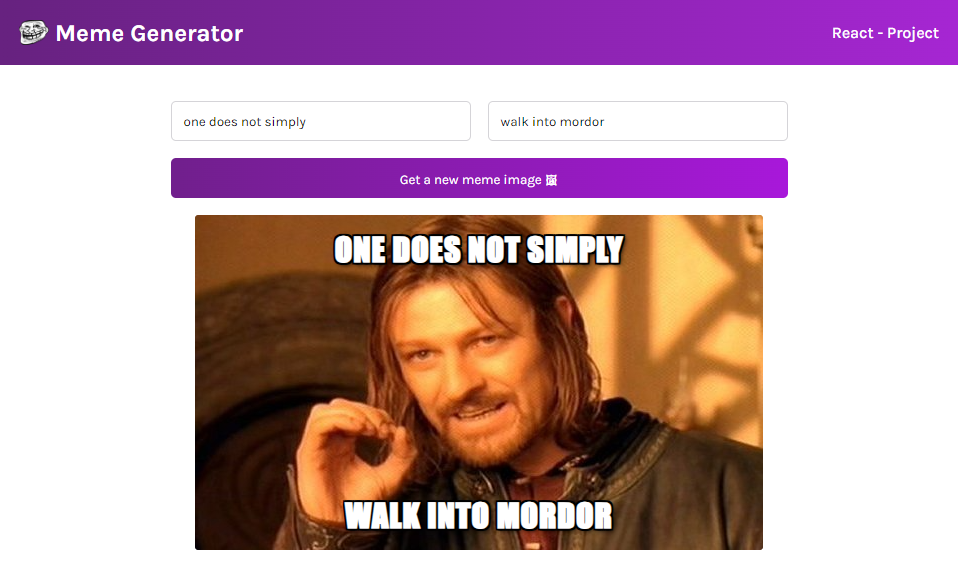
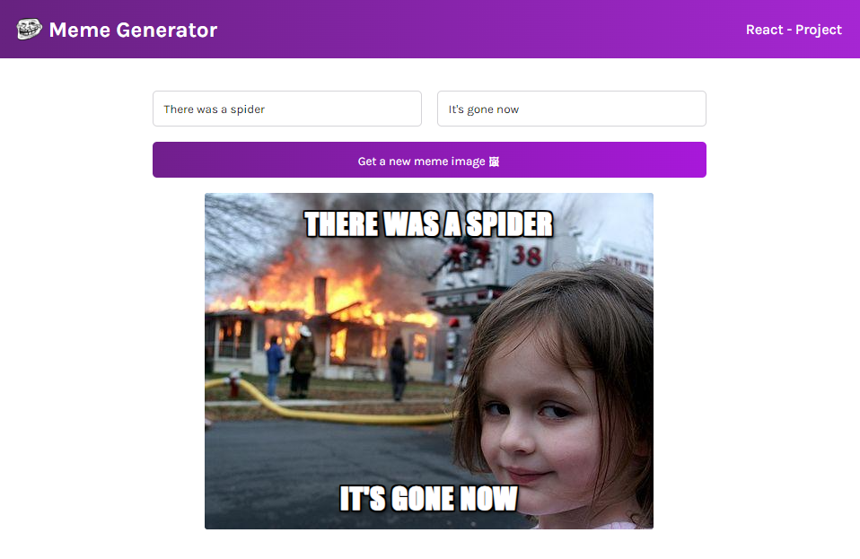

# Meme Generator App



A basic React app to generate random memes and give them your own punchlines!

- You can click the Generate a new meme image button which will give you a random popular meme.
- You can provide your own punchline that will appear in the top and bottom of the meme image.

## Generate new Meme image



(**New Feature to be developed**: Add a copy to clipboard button or share button)

> The main objective behind working on this project is to showcase my skills and knowledge on React and personally to practice more on the same.

## Clone and Setup

This project was setup using `Vite⚡`.

1. Clone the project into your required folder
2. Go to the `/meme-generator-app` directory
3. Install the required dependencies for this project.

   ```bash
   npm install
   ```

4. Run the application.
   ```bash
   npm run dev
   ```

## Vite plugins

This template provides a minimal setup to get React working in Vite with HMR and some ESLint rules.

Currently, two official plugins are available:

- [@vitejs/plugin-react](https://github.com/vitejs/vite-plugin-react/blob/main/packages/plugin-react/README.md) uses [Babel](https://babeljs.io/) for Fast Refresh
- [@vitejs/plugin-react-swc](https://github.com/vitejs/vite-plugin-react-swc) uses [SWC](https://swc.rs/) for Fast Refresh
